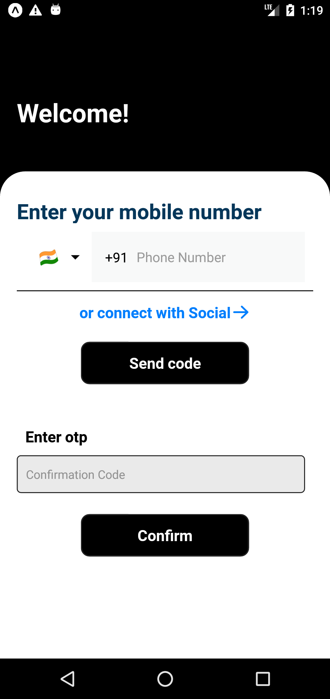
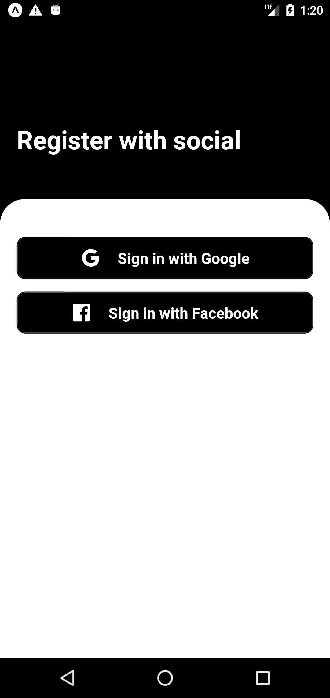
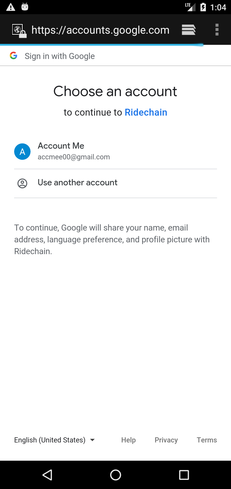
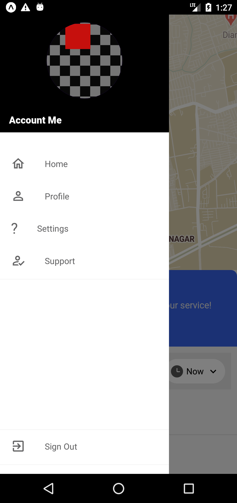
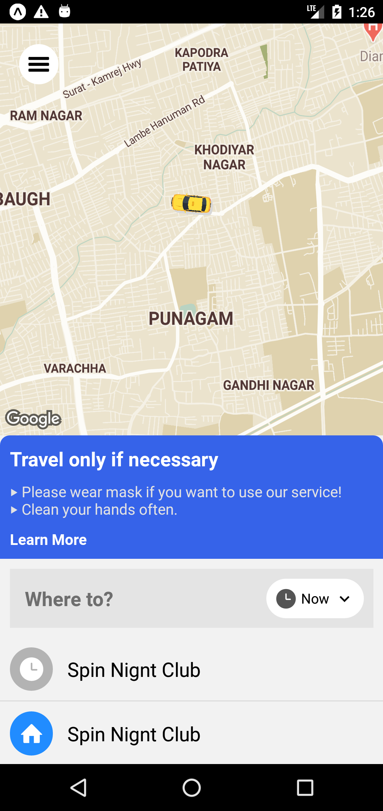
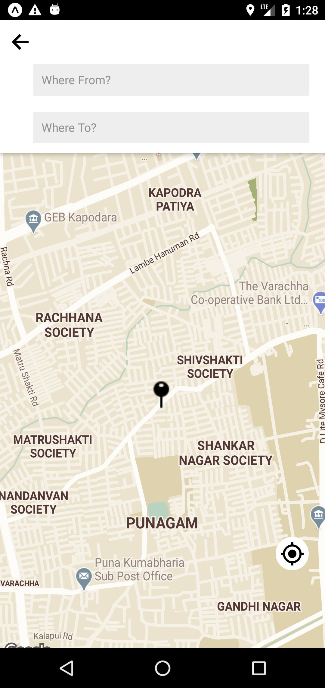
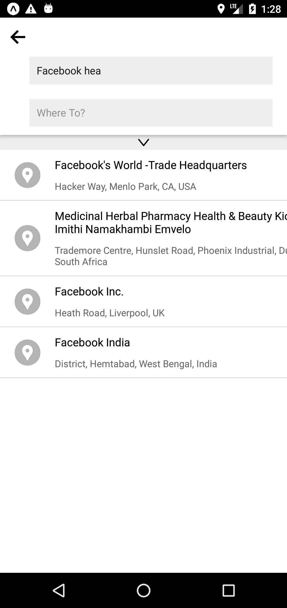
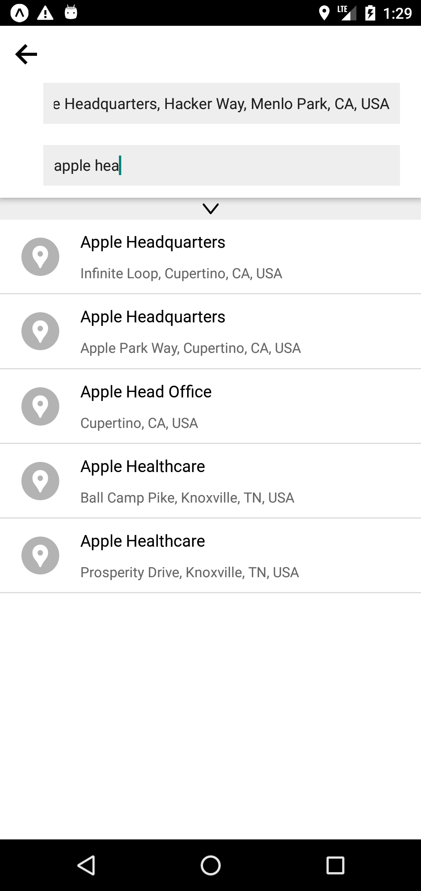
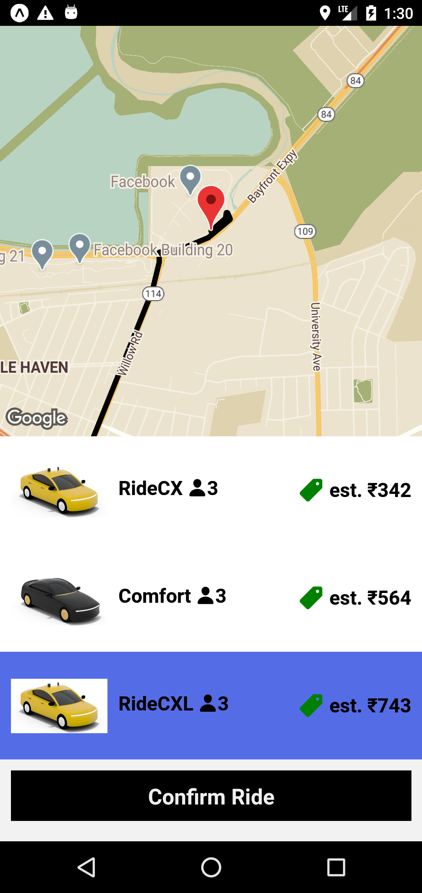
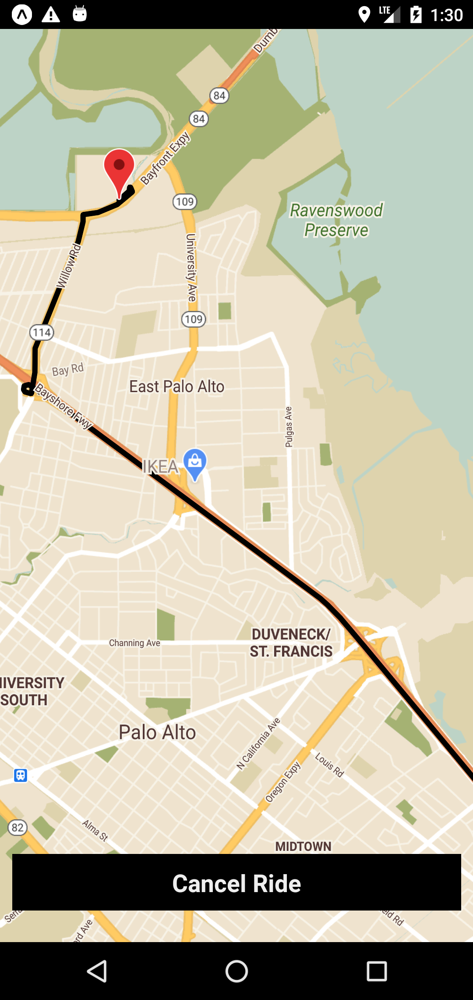

Here are pictures of working App.

1. Splash screen and login screen   
    

2. Login with google   
    

3. Drawer menu and Home Screen   
    

4. Selecting Pick up and Destination location   
     

5. Selecting Ride   
    
